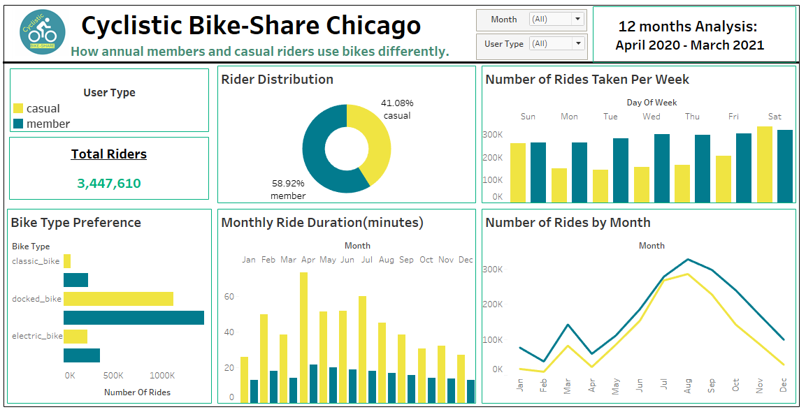

# Cyclistic-Bike-Share Chicago
## Google Data Analytics capstone project
### Author : Millicent Ofobuike
#### Data Date: April 2020 - March 2021.

### Introduction

This is a case study project I am to perform data analysis for a fictional 
bike-share company based in Chicago in order to help them attract more riders.

##### About the Company
In 2016, Cyclistic launched a successful bike-share offering. Since then,
the program has grown to a fleet of 5,824 bicycles that are geotracked and
locked into a network of 692 stations across Chicago. The bikes can be unlocked
from one station and returned to any other station in the system anytime.
Until now, Cyclistic’s marketing strategy relied on building general awareness
and appealing to broad consumer segments.One approach that helped make these
things possible was the flexibility of its pricing plans: single-ride passes,
full-day passes,and annual memberships. Customers who purchase single-ride or
full-day passes are referred to as casual riders. Customers who purchase annual
memberships are Cyclistic members.


Cyclistic’s finance analysts have concluded that annual members are much more
profitable than casual riders. Although the pricing flexibility helps Cyclistic
attract more customers, Moreno believes that maximizing the number of annual
members will be key to future growth. Rather than creating a marketing campaign
that targets all-new customers, Moreno believes there is a very good chance to
convert casual riders into members. She notes that casual riders are already
aware of the Cyclistic program and have chosen Cyclistic for their mobility
needs.


Moreno, the director of marketing, has set a clear goal: Design marketing
strategies aimed at converting casual riders into annual members. In order to
do that, however, the marketing analyst team needs to better understand how
annual members and casual riders differ, why casual riders would buy a
membership, and how digital media could affect their marketing tactics. Moreno
and her team are interested in analyzing the Cyclistic historical bike trip data
to identify trends.


As a junior data analyst working in the marketing analyst team at Cyclistic,
The director of marketing, Moreno, believes the company’s future success depends
on maximizing the number of annual memberships. Therefore,the team wants to
understand how casual riders and annual members use Cyclistic bikes differently.
From these insights, the team will design a new marketing strategy to convert
casual riders into annual members.


### **Business** **Task**

How do annual members and casual riders use Cyclistic bikes differently?
Use Cyclistic’s historical trip data to analyze and identify trends.


### **Key** **Stakeholders**

      Lily Moreno
      Cyclistic marketing analytics team
      Cyclistic executive team


### **Data** **Background**

The data is a public data made available by Motivate International Inc. under this 
license (https://www.divvybikes.com/data-license-agreement). For the sake of 
privacy, riders personal identifiable information were not included.This is a
link to the dataset: (https://divvy-tripdata.s3.amazonaws.com/index.html).

I downloaded the previous 12 months of Cyclistic trip data (April 2020-March 2021).
I unzipped and created a folder in my desktop to house the files.

R was chosen to analyze the data due to the size of the dataframe.

To import and analyze the dataframes, I installed and loaded readr,tidyverse,
lubridate,dplyr packages.

```{r}
library(readr)
library(tidyverse)
library(lubridate)
library(dplyr)
```

*ds1-ds12* were used to name the files after which *bike_rides* was used to bind
them.

###### Name and import the dataframes.

```{r}
ds1 <- read.csv("april_2020_trip.csv")
ds2 <- read.csv("may_2020_trip.csv")
ds3 <- read.csv("june_2020_trip.csv")
ds4 <- read.csv("july_2020_trip.csv")
ds5 <- read.csv("august_2020_trip.csv")
ds6 <- read.csv("september_2020_trip.csv")
ds7 <- read.csv("october_2020_trip.csv")
ds8 <- read.csv("november_2020_trip.csv")
ds9 <- read.csv("december_2020_trip.csv")
ds10 <- read.csv("january_2021_trip.csv")
ds11 <- read.csv("february_2021_trip.csv")
ds12<- read.csv("march_2021_trip.csv")
```

We look at the structure of the datasets using the str() and also look at
the first 6 rows using the glimpse(). 

```{r}
str(ds1)
glipmse(ds1)
str(ds2)
glipmse(ds2)
str(ds3)
glimpse(ds3)
str(ds4)
glimpse(ds4)
str(ds5)
glimpse(ds5)
str(ds6)
glimpse(ds6)
str(ds7)
glimpse(ds7)
str(ds8)
glimpse(ds8)
str(ds9)
glipmse(ds9)
str(ds10)
glimpse(ds10)
str(ds11)
glimpse(ds11)
str(ds12)
glimpse(ds12)
```

The datasets have the same structure so
we combine them using rbind().

```{r}
bike_rides <- rbind(ds1,ds2,ds3,ds4,ds5,ds6,ds7,ds8,ds9,ds10,ds11,ds12)

str(bike_rides)
```

We familiarize ourselves with the data, from this output, we can see that we
have 3489748 rows and 13 columns. We check for structural errors.
we can see that the started_at and ended_at columns are formatted as character,
so we change it to date time. We can also see that the column names like 
member_casual and rideable_type are not properly named.


### Data Cleaning.

###### changing date time to the appropriate structure.

```{r}
bike_rides$started_at <- lubridate::mdy_hm(bike_rides$started_at)

bike_rides$ended_at <- lubridate::mdy_hm(bike_rides$ended_at)
```

###### Cleaning the column names.

```{r}
bike_rides %>% rename(user_type = member_casual)
bike_rides %>% rename(bike_type = rideable_type)
```

###### We create a new dataframe ride_length.

```{r}
bike_rides$ride_length <- difftime(bike_rides$ended_at,
bike_rides$started_at, units = "mins")
```

###### We create day_of_week and month dataframes.

```{r}
bike_rides_cleaned$day_of_week <- weekdays(bike_rides_cleaned$started_at)
bike_rides_cleaned$month <- format(as.Date(bike_rides_cleaned$started_at), "%b")
```

###### We clean the data by removing the NAs and ride length < 0.
we assign the new dataframe's name as *bike_rides_cleaned*.

```{r}  
bike_rides_cleaned <- bike_rides %>%
  filter(ride_length > 0)     
``` 

###### After removing NAs we are left with 3,447,610 rows and 16 columns.

```{r} 
str(bike_rides_cleaned)     # to view the structure of the data
  View(bike_rides_cleaned)      # to view the data 
``` 

### Analyzing the Dataframe.

We have the information we need to understand how the members and casual riders
  use bikes differently. Now we summarize it.

```{r}
day_of_week_summary <- bike_rides_cleaned %>% mutate(day_of_week = wday(started_at,
label =  TRUE, week_start = getOption("lubridate.week.start" , 7))) %>%
  group_by(member_casual, day_of_week) %>% summarise(number_of_rides = n(),
  avg_ride_length = mean(ride_length))
write.csv(day_of_week_summary, "day_of_week_summary.csv", row.names = FALSE)
```


```{r}
bike_type_preference <- bike_rides_cleaned %>%
  group_by(member_casual,rideable_type,day_of_week) %>%
  summarise(number_of_rides = n(), avg_ride_length = mean(ride_length))
  write.csv(bike_type_preference, "bike_type_preference.csv", row.names = FALSE)
```


```{r}
ride_length_by_month <- bike_rides_cleaned %>% group_by(member_casual,month)%>%
   summarise(number_of_rides = n(),mean_ride_length = mean(ride_length)) %>%
   arrange(month)
write.csv(ride_length_by_month, "ride_length_by_month.csv", row.names = FALSE)
```


```{r}
total_riders <- data.frame (table(bike_rides_cleaned$member_casual))
  hsize <- 1.5
  write.csv(total_riders, "total_riders.csv", row.names = FALSE)  
```


We export to Tableau for further visualization.
### Dashboard



## Observation
  
  * Members had the highest number of rides. Members total ride is 
  approximately 2 million rides which is 59% of total rides.

  * Casual riders had approximately 1.5 million rides which is 41% of total rides.

  * Docked bike is more popular between members and casual riders.
   *  Casual Riders take longer rides during the weekdays. The rides are longest 
during the weekends. 
Members take averagely same number of rides during the weekdays.

  * Casual riders used the bikes for a longer time in the month of April 2020 
followed by July 2021.Members had the longest ride duration in April 2020.

  * Members had the highest number of rides in the month of August 2021.
Casual riders had the highest number of rides in August 2021 too.
The total number of rides for both member and casual riders increased steadily 
from the month of May,peaked at the month of August then started 
dropping afterwards.We can assume that this was possible because it was summer.
To confirm this we have to analyze data from previous years. 

## Recommendations

  * The marketing team should create a coupon or voucher that gives a discount to
registered annual riders with trips that last more than 20 minutes.Since casual
riders take longer trips, this will encourage them to register as annual users.

  * They can share fliers and run promotions on the annual tickets at the stations
during the weekends since the casual riders take more rides then.
